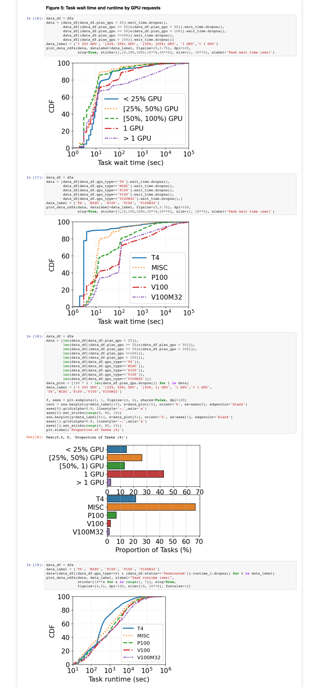

# 1 Introduction

The released trace contains a hybrid of training and inference jobs running state-of-the-art ML algorithms. It is collected from a large production cluster with over 6,500 GPUs (on ~1800 machines) in [Alibaba PAI (Platform for Artificial Intelligence)](https://www.alibabacloud.com/product/machine-learning), spanning the July and August of 2020.
We also include a [Jupyter notebook](./analysis/analysis.ipynb) that parses the trace and highlights some of the main characteristics (see section [3 Demo of Data Analysis](#3-demo-of-data-analysis)).


We also present a characterization study of the trace in a paper, ["MLaaS in the Wild: Workload Analysis and Scheduling in Large-Scale Heterogeneous GPU Clusters"](https://home.cse.ust.hk/~weiwa/papers/weng-nsdi22.pdf), published in [NSDI ’22](https://www.usenix.org/conference/nsdi22). We would encourage anybody who uses this trace to cite our paper.

```BibTeX
@inproceedings{weng2022mlaas,
  title={{MLaaS} in the Wild: Workload Analysis and Scheduling in Large-Scale Heterogeneous {GPU} Clusters},
  author={Weng, Qizhen and Xiao, Wencong and Yu, Yinghao and Wang, Wei and Wang, Cheng and He, Jian and Li, Yong and Zhang, Liping and Lin, Wei and Ding, Yu},
  booktitle={19th $\{$USENIX$\}$ Symposium on Networked Systems Design and Implementation ($\{$NSDI$\}$ 22)},
  year={2022}
}
```

**Table of Contents**

- [1 Introduction](#1-introduction)
- [2 Data Files in the Trace](#2-data-files-in-the-trace)
  - [pai_job_table](#pai_job_table)
  - [pai_task_table](#pai_task_table)
  - [pai_instance_table](#pai_instance_table)
  - [pai_sensor_table](#pai_sensor_table)
  - [pai_group_tag_table](#pai_group_tag_table)
  - [pai_machine_spec](#pai_machine_spec)
  - [pai_machine_metric](#pai_machine_metric)
- [3 Demo of Data Analysis](#3-demo-of-data-analysis)


# 2 Data Files in the Trace


The figure above illustrates an architecture overview of PAI, where users submit ML jobs developed in a variety of frameworks (e.g., TensorFlow, PyTorch, Graph-Learn).
Upon the job submission, users provide the application code and specify the required compute resources, such as GPUs, CPUs, and memory. Each **job** is translated into multiple **tasks** of different roles, such as parameter servers (PS) and workers for a training job, and evaluator for an inference job. Each task may consist of one or multiple **instances** and can run on multiple machines.
PAI employs Docker containers to instantiate tasks for simplified scheduling and execution on heterogeneous hardware.
For example, the following job requests 14 CPUs (600% + 400% + 400%) and 1 GPU (0% + 50% + 50%) from the cluster with its three instances.


Below is a brief description of all the tables (hyperlinked to `tar.gz` files to be placed under [./data](./data) folder); the details are deferred to their sections.

- [**pai_job_table**](https://aliopentrace.oss-cn-beijing.aliyuncs.com/v2020GPUTraces/pai_job_table.tar.gz): job launch information.
- [**pai_task_table**](https://aliopentrace.oss-cn-beijing.aliyuncs.com/v2020GPUTraces/pai_task_table.tar.gz): task launch information.
- [**pai_instance_table**](https://aliopentrace.oss-cn-beijing.aliyuncs.com/v2020GPUTraces/pai_instance_table.tar.gz): instance launch information.
- [**pai_sensor_table**](https://aliopentrace.oss-cn-beijing.aliyuncs.com/v2020GPUTraces/pai_sensor_table.tar.gz): instance resource sensor information.
- [**pai_group_tag_table**](https://aliopentrace.oss-cn-beijing.aliyuncs.com/v2020GPUTraces/pai_group_tag_table.tar.gz): instance semantic information.
- [**pai_machine_spec**](https://aliopentrace.oss-cn-beijing.aliyuncs.com/v2020GPUTraces/pai_machine_spec.tar.gz): machine specification.
- [**pai_machine_metric**](https://aliopentrace.oss-cn-beijing.aliyuncs.com/v2020GPUTraces/pai_machine_metric.tar.gz): machine resource metrics with respect to the instance.

(Alternative download links: [data repo on GitHub](https://github.com/qzweng/clusterdata-cluster-trace-gpu-v2020-data))

**Checksum** (replacing `sha256sum` with `shasum` for macOS users)
```bash
$sha256sum -c << EOF
722fef30b7fb7aa50dabd79155614b5423a9d65cf45a9b26c590d57725423a14  pai_group_tag_table.tar.gz
1bf1e423a7ce3f8d086699801c362fd56a7182abdb234139e5ebbed97995ca06  pai_instance_table.tar.gz
5aad7f7caac501136d14ed6a48e40546f825d7b0617a3a4f337e2348fe0a6cb0  pai_job_table.tar.gz
53ad917193d3b1dd0f3055e723148b1f36c2f81789b014ea2930a7875892eef5  pai_machine_metric.tar.gz
cc0d38a4045af1b1af8179de8b1b54b1ddd995e6160d6d061a6b1000f1276c2d  pai_machine_spec.tar.gz
9a0b82e8bdf3949281e4ba1423d9b4b34847e52799eecb138966de46da69c7a0  pai_sensor_table.tar.gz
cd1d6dc3215d2a8607ccf6b6dd952b5db776df86926c73259fea7c1499ac40e5  pai_task_table.tar.gz
320470fa8f77182bc6052c95ff359b75542c748e9516b3d8148a6e2bafc1798d  pai_group_tag_table.header
51f2585178eaaf30ad8cc88c50ec9243b0f7d9603603ab7602efccb7aa34f6b0  pai_instance_table.header
3ac33aefab9a4d81338794fa145fe280594a379444961a9c639f00181c508567  pai_job_table.header
300342613103c6192490f8990958903d837053c13adbc6c094d677074fbbb7ad  pai_machine_metric.header
4c9ea25914ff3f0b73be9ff223fb91002e787138165abd3f584ba37281448e1c  pai_machine_spec.header
d3e26eb31fb3b833821373b487266312151a3bfb2f18fc62017a438546cc1362  pai_sensor_table.header
978bbaabfc8695874c605c01c144b2977f611ceca73aeb72189988cdfbfb0a9c  pai_task_table.header
EOF
```

**Size of file**
```bash
$ls -sh1 *.tar.gz
 53M pai_group_tag_table.tar.gz
663M pai_instance_table.tar.gz
 60M pai_job_table.tar.gz
198M pai_machine_metric.tar.gz
 32K pai_machine_spec.tar.gz
388M pai_sensor_table.tar.gz
 34M pai_task_table.tar.gz
```

**Usage**
```bash
$for file in `ls *.tar.gz`; do tar -xzf $file; done
$sha256sum -c << EOF
d23fcb56d88b2976fda4a62708d77b2a8c98635c4b443f100ed5553d4cd07fbe  pai_group_tag_table.csv
b179f7d7e0927a6663d719b728c92640447c5a0fc3c6e4edff31e7207ab9dd17  pai_instance_table.csv
379ecb3becaba347f44a53bf7eb53e54b185221b2a0338a3f828828d269ba96c  pai_job_table.csv
8b6592daab0373ef7fec730198b4df5891b1722c2ab4c7016249166e131402d3  pai_machine_metric.csv
251e9e33649155a6a935fdc1dc0e90cd4698206936b60bd8fce60ff2ccd51439  pai_machine_spec.csv
12dd9929b70f3efe18d1279d9873e3a519c64f431613b23b059ed8c46a376dd7  pai_sensor_table.csv
6954802b457305f8a9e480ef97c40060baee59649fd3adc62c5a1e048aa058de  pai_task_table.csv
EOF
```

## pai_job_table
**job launch information.**

| Columns    | Example Entry                                                |
|:-----------|:-------------------------------------------------------------|
| job_name   | 4b3f04b66a525d2df903eb16                                     |
| inst_id    | 8cb3bec23d14dbde320b6613452e768cbbf35b8bd64ee28fcceb77d3c47d |
| user       | 58540f191766                                                 |
| status     | Terminated                                                   |
| start_time | 4550879.0                                                    |
| end_time   | 4551416.0                                                    |

- `job_name`: name of users' submit jobs. It has been desensitized to protect users' privacy (similar to `user_name`, `worker_name`, `inst_name`, etc. below).
- `inst_id`: please treat or revise it as `job_id`, since each `job_name` corresponds to one `inst_id`.  It can be joined with `inst_id` in [pai_sensor_table](#pai_sensor_table) and [pai_group_tag_table](#pai_group_tag_table).
- `user`: user name.
- `status`: job status, including 'Running', 'Terminated', 'Failed', 'Waiting'; only 'Terminated' tasks are successful.
- `start_time`: timestamp of job submission time.
- `end_time`: timestamp of job completion time.

**Note of `time`**: Both `start_time` and `end_time` are in *seconds* and have been deducted by a constant number for desensitization. Still, if translated to Unix time in UTC+8 timezone ("Asia/Shanghai"), they will have the same time of the day (e.g., "08:59:59 UTC+8") and the same day of the week (e.g., "Sunday") as the original traces, while having fake dates, months, and years.


## pai_task_table

**task launch information.**

| Columns    | Example Entry            |
|:-----------|:-------------------------|
| job_name   | 4f057009a5d481acec67b088 |
| task_name  | tensorflow               |
| inst_num   | 1.0                      |
| status     | Terminated               |
| start_time | 1739162.0                |
| end_time   | 1739200.0                |
| plan_cpu   | 600.0                    |
| plan_mem   | 29.296875                |
| plan_gpu   | 50.0                     |
| gpu_type   | MISC                     |

- `job_name`: job name; same as the entry in [pai_job_table](#pai_job_table).
- `task_name`: most jobs have only one task, but some may launch multiple tasks of different names (roles), e.g., `ps`, `worker`, `evaluator`.
- `inst_num`: number of instances launched by the task.
- `status`: task status.
- `start_time`: timestamp of task launch time. The gap between `job.start_time` and the earliest `task.start_time` in the job implies its wait time before launching (scheduling latency).
- `end_time`: timestamp of task completion time.
- `plan_cpu`: number of CPU cores requested in percentage (i.e., 600.0 is 6 vCPU cores) .
- `plan_mem`: GB of main memory requested.
- `plan_gpu`: number of GPUs requested in percentage (i.e., 50.0 is 50% GPU).
- `gpu_type`: type of GPUs assigned to this task. `MISC` is short for "miscellaneous", indicating GPUs of older generations, e.g., NVIDIA Tesla K40m, K80, M60.


## pai_instance_table

**instance launch information.**

| Columns     | Example Entry                                                |
|:------------|:-------------------------------------------------------------|
| job_name    | af724763f4f5d0beef445849                                     |
| task_name   | worker                                                       |
| inst_name   | 0d39aa867a79c16eff67daa8f6248f09af8346b177c9e3e23645c48354a8 |
| worker_name | 54dbcd2db287841c03d0639b2a93e783a090ea085348f8cdb8e603d8b96f |
| inst_id     | e387fbc18d80cc3c9ca4f1f13ff1d46778c9a25eaaeca2a95314fdf20d8e |
| status      | Terminated                                                   |
| start_time  | 2081336.0                                                    |
| end_time    | 2083889.0                                                    |
| machine     | 471dda9ed84965451e042145                                     |

- `job_name`: job name; same as the entry in [pai_job_table](#pai_job_table).
- `task_name`: task name; same as the entry in [pai_task_table](#pai_task_table).
- `inst_name`: name of instance in each task.
- `worker_name`: information to distinguish instances; it is more detailed than `inst_name` and to be joined with `worker_name` in [pai_sensor_table](#pai_sensor_table) and [pai_machine_metric](#pai_machine_metric).
- `inst_id`: please treat or revise it as `job_id`, since each `job_name` corresponds to one `inst_id`; same as the entry in [pai_job_table](#pai_job_table)
- `status`: instance status.
- `start_time`: timestamp of instance launch time.
- `end_time`: timestamp of instance completion time.
- `machine`: the name of machine that the instance resides on, to be joined with `machine` in [pai_machine_spec](##pai_machine_spec) and [pai_machine_metric](#pai_machine_metric).


## pai_sensor_table

**instance resource sensor information.**

| Columns         | Example Entry                                                |
|:----------------|:-------------------------------------------------------------|
| job_name        | a9449d475665e3bf0512520b                                     |
| task_name       | worker                                                       |
| worker_name     | bcecec52225d6b4ae6bc724ce0269a02026195a364f54cf4850c2cca0054 |
| inst_id         | 589de47b56f88129837f506134b874e0356dc0931732a687bcf907fb8325 |
| machine         | 6884752e3565b15cafe14218                                     |
| gpu_name        | /dev/nvidia0                                                 |
| cpu_usage       | 140.1451612903226                                            |
| gpu_wrk_util    | 16.0625                                                      |
| avg_mem         | 1.4627511160714286                                           |
| max_mem         | 2.3935546875                                                 |
| avg_gpu_wrk_mem | 1.2446746826171875                                           |
| max_gpu_wrk_mem | 2.3994140625                                                 |
| read            | 21271328.384615384                                           |
| write           | 16376189.815384615                                           |
| read_count      | 2922.4461538461537                                           |
| write_count     | 3419.7846153846153                                           |

- `job_name`: job name; same as the entry in [pai_job_table](#pai_job_table).
- `task_name`: task name; same as the entry in [pai_task_table](#pai_task_table).
- `worker_name`: worker name; same as the entry in [pai_instance_table](#pai_instance_table).
- `inst_id`: please treat or revise it as `job_id`, since each `job_name` corresponds to one `inst_id`. Same as the entry in [pai_job_table](#pai_job_table)
- `machine`: machine name; same as the entry in [pai_instance_table](#pai_instance_table).
- `gpu_name`: name of the GPU on that machine (not `gpu_type`).
- `cpu_usage`: number of CPU cores used in percentage (i.e., 600.0 is 6 vCPU cores) (c.f. `plan_cpu` in [pai_task_table](#pai_task_table)).
- `gpu_wrk_util`: number of GPUs used in percentage (i.e., 50.0 is 50% GPU) (c.f., `plan_gpu` in [pai_task_table](#pai_task_table)).
- `avg_mem`: GB of main memory used (in average) (c.f., `plan_mem` in [pai_task_table](#pai_task_table)).
- `max_mem`: GB of main memory used (maximum) (c.f., `plan_mem` in [pai_task_table](#pai_task_table)).
- `avg_gpu_wrk_mem`: GB of GPU memory used (in average).
- `max_gpu_wrk_mem`: GB of GPU memory used (maximum).
- `read`: Bytes of network input.
- `write`: Bytes of network output.
- `read_count`: Number of times of network read input.
- `write_count`: Number of times of network write output.

**Note of `sensor`**: all the sensor metrics (CPU, GPU, Memory, I/O) in this table are collected for each *instance* (indexed by  `worker_name`) but *not task*, taking the average of all data in the instance's lifetime (except for `max_mem` and `max_gpu_wrk_mem` being the maximum).


## pai_group_tag_table

**instance semantic information.**

| Columns       | Example Entry                                                |
|:--------------|:-------------------------------------------------------------|
| inst_id       | f7f6218cb5cb82e00b85476691d15d5055c143a351396d8f81737421dbd6 |
| user          | d2d3b77d342e                                                 |
| gpu_type_spec | V100M32                                                      |
| group         | fbeb14d671c629b6e82bee889fe4bb4c                             |
| workload      | nmt                                                          |

- `inst_id`: please treat or revise it as `job_id`, since each `job_name` corresponds to one `inst_id`. Same as the entry in [pai_job_table](#pai_job_table)
- `user`: user name; same as the entry in [pai_job_table](#pai_job_table).
- `gpu_type_spec`: being empty if the instance does not specify GPU type requirements, else being one of the `gpu_type` in [pai_task_table](#pai_task_table).
- `group`: a semantic tag that indicates some instances have similar customized inputs, e.g., entry scripts, command-line parameters, data sources and sinks; consequently, instances with the same group tag are considered as repeated instances. Please refer to the trace analysis paper for detailed discussion.
- `workload`: we study some Deep Learning tasks by investigating their customized inputs (mentioned above) and record their workload in this field; around 9% instances have this tag, including `graphlearn`, `ctr`, `bert`, etc.


## pai_machine_spec

**machine specification.**

| Columns  | Example Entry            |
|:---------|:-------------------------|
| machine  | 82e5af3cd5c4af3f56c62c54 |
| gpu_type | T4                       |
| cap_cpu  | 96                       |
| cap_mem  | 512                      |
| cap_gpu  | 2                        |

- `machine`: machine name; same as the entry in [pai_instance_table](#pai_instance_table).
- `gpu_type`: GPU type; same as the entry in [pai_task_table](#pai_task_table).
- `cap_cpu`: CPU capacity; number of CPU cores in the machine.
- `cap_mem`: memory capacity; GB of main memory capacity in the machine.
- `cap_gpu`: GPU capacity; number of GPU in the machine.


## pai_machine_metric

**machine resource metrics with respect to the instance.**

| Columns             | Example Entry                                                |
|:--------------------|:-------------------------------------------------------------|
| worker_name         | b739d0d058e0db100aaf47e48a4d61320c95c2f5a334a8262d5e830d849c |
| machine             | 74e1c8457b01c76b314b22bb                                     |
| start_time          | 6150435                                                      |
| end_time            | 6150689                                                      |
| machine_cpu_iowait  | 0.0028667003281999497                                        |
| machine_cpu_kernel  | 3.583656890012642                                            |
| machine_cpu_usr     | 14.928745108999438                                           |
| machine_gpu         | 87.82875849911859                                            |
| machine_load_1      | 18.298592909228066                                           |
| machine_net_receive | 111649584.57135652                                           |
| machine_num_worker  | 5.053068410462776                                            |
| machine_cpu         | 18.515268699340282                                           |

- `worker_name`: worker name; same as the entry in [pai_instance_table](#pai_instance_table).
- `machine`: machine name; same as the entry in [pai_instance_table](#pai_instance_table).
- `start_time`: timestamp of instance launch time; same as the entry in [pai_instance_table](#pai_instance_table).
- `end_time`: timestamp of instance completion; same as the entry in [pai_instance_table](#pai_instance_table).
- `machine_cpu_iowait` : machine-level metrics of CPU I/O wait.
- `machine_cpu_kernel` : machine-level metrics of CPU kernel usage.
- `machine_cpu_usr` : machine-level metrics of CPU user usage.
- `machine_gpu` : machine-level metrics of GPU utilization.
- `machine_load_1` : machine-level metrics of 1-min load average.
- `machine_net_receive` : machine-level metrics of network received bytes.
- `machine_num_worker` : machine-level metrics of number of co-located instances (workers).
- `machine_cpu` : machine-level metrics of CPU overall usage.

**Note of `machine_` metrics**: these metrics are machine-level metrics, taking average of the sensor data during the instance's (indexed by `worker_name`) lifetime.


# 3 Demo of Data Analysis

The displayed [Jupyter notebook](./analysis/analysis.ipynb) and the underlying [utility script](./analysis/utils.py) can be found under the [analysis](./analysis) directory.





