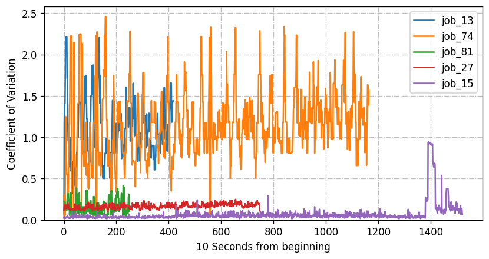
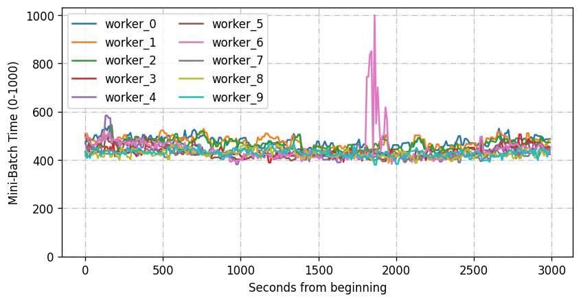
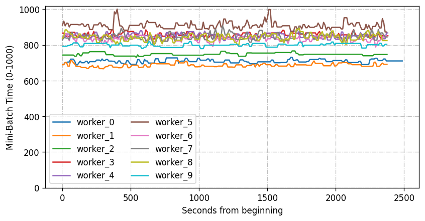
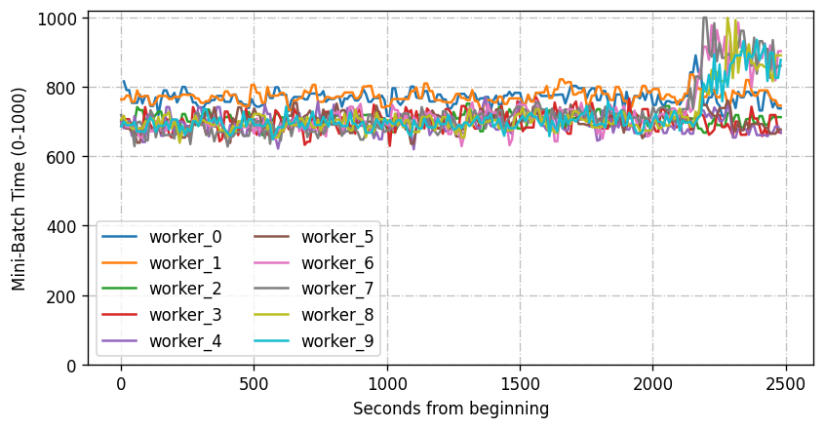
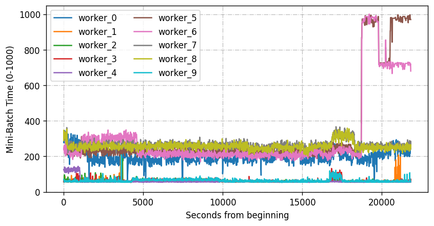

# Mini-batch Time of Workers in Distributed Training Jobs on PAI

Motivated by the interest in the released traces on GPU workloads, we further release the mini-batch time of each worker in some distributed training jobs on the Alibaba Platform of AI (PAI).

"Mini-batch time": Deep learning training processes a mini-batch of data, typically between 8 and 512 samples, in each iteration. Usually, a training mini-batch can be divided into 1) forward pass, 2) backward pass, and 3) model parameters update [Xiao et al., 2020]. In distributed training jobs, multiple workers usually have the same mini-batch size (i.e., the number of samples) and perform the same operations on the data.  The time they spent on processing their mini-batch of data is defined as mini-batch time.

Note that the mini-batch time has been normalized to 0-1000. The focus of this dataset is to reveal the diverse mini-batch time among different workers of the same training job rather than their precise duration. For detailed distribution of mini-batch time, please refer to Fig. 5(b) in the "AntMan" paper [Xiao et al., 2020].

> Xiao, W., Ren, S., Li, Y., Zhang, Y., Hou, P., Li, Z., ... & Jia, Y. (2020). AntMan: Dynamic Scaling on GPU Clusters for Deep Learning. In Proc. USENIX OSDI.

## coefficient_variation.csv

Each row of data is one training job while columns are the iterations. Each value represents the coefficient of variation (CoV) calculated by all workers of a certain job in a certain iteration. The released data includes 100 training jobs that each have 10 workers.

Coefficient of variation is defined as: $c_v = \sigma/\mu$. (See [Wikipedia](https://en.wikipedia.org/wiki/Coefficient_of_variation)), where $\sigma = \sqrt{\frac{1}{N}\sum_{i=1}^N(X_i-\mu)^2}$ is the standard deviation and $\mu$ is the mean value of all workers' mini-batch durations. Since the mean mini-batch time could vary widely among different jobs, we use CoV instead of standard deviation to capture this variation.

The following figure shows the CoV of 5 sampled jobs. The diversity of CoV can be observed among different jobs and different iterations during the training process. 

## job_1_norm.csv

- GPU request for each worker: 25% of one GPU
- Observation: Straggler (worker 6) emerges in the middle of the training.

## job_2_norm.csv

- GPU request for each worker: 20% of one GPU
- Observation: Although the variation seems stable during the training process, different workers have different mini-batch times.

## job_3_norm.csv

- GPU request for each worker: 25% of one GPU
- Observation: There could be multiple stragglers.

## job_4_norm.csv

- GPU request for each worker: 50% of one GPU
- Observation: There could be multiple stragglers. The mini-batch time may fluctuate.

