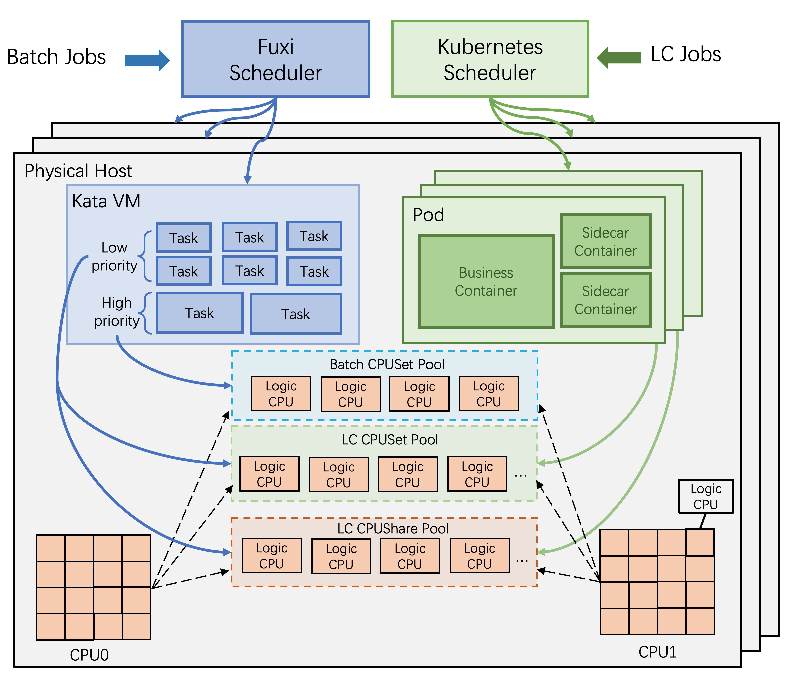

# 1 Introduction

Understanding the microarchitectural resource characteristics of datacenter jobs has become increasingly critical to guarantee the performance of jobs while improving resource utilization. We provide a new open trace, AMTrace (Alibaba Microarchitecture Trace ), which is profiled from 8,577 high-end physical hosts from Alibaba’s datacenter by a hardware/software co-design monitoring method. AMTrace provides the microarchitectural metrics of 9.8 × 10^5 Linux containers with "per-container-per-logic CPU" granularity. AMTrace provides a new perspective to analyze the microarchitectural resource characteristics of datacenter jobs.

**Table of Contents**

- [1 Introduction](#1-introduction)
- [2 System Architecture](#2-system-architecture)
- [3 Tables](#3-tables)
  - [core_pmu_metrics](#core_pmu_metrics)
  - [uncore_pmu_metrics](#uncore_pmu_metrics)
  - [container_meta](#container_meta)
  - [host_meta](#host_meta)
- [4 Data](#4-data)
- [5 Analysis Scripts](#5-analysis-scripts)

# 2 System Architecture

Most LC jobs in Alibaba are Java-based e-commerce trading applications. They are containerized and scheduled by Kubernetes. Batch jobs are data processing batch jobs, such as Map-Reduce jobs, Spark jobs, and machine-learning training jobs. They are scheduled by Fuxi. To improve resource utilization, Alibaba uses a colocation architecture (shown in Figure 1), which can colocate LC jobs and Batch jobs on the same host and adopt several resource management technologies to mitigate resource contention.  

To reduce CPU contention, we divide all logic CPUs into three groups: Batch CPUSet Pool, LC CPUSet Pool, and LC CPUShare Pool. The sizes of the three pools change dynamically with job scheduling. Jobs are scheduled to the corresponding groups according to their priority. The largest resource consumer, CPUShare Batch jobs, are allowed to utilize the resources in both LC CPUSet Pool and LC CPUShare Pool, but their resource priority is the lowest.

Other adopted resource isolation technologies, including CAT, BVT scheduling, and noise clean, are shown in our paper.

# 3 Tables

## core_pmu_metrics

| Columns    | Description     | Type    |Example Entry            |
|:-----------|:----------------|:--------|:---------------------------|
| ts         | Timestamp, the number of seconds from the start      |Long |46309 |
| node_id    | ID of the node  |String   |e7a66b9189940e9d6102 |
| container_id|ID of the container|String|213aff2b3dbec1f7c212|
| cpu           |logic cpu id|Int    | 23|
| core_id       |core id |Int | 23|
|socket_id      |socket id|Int | 0|
|instructions   |number of instructions happened on the `logic cpu`|Long | 694470820|
|cycles         |number of cycles happened on the `logic cpu`|Long   |1391935375|
|ref_cycles|number of reference cycles happened on the `logic cpu` |Long|1284610800|
|llc_misses |number of LLC cache misses happened on the `logic cpu` |Long|6667696|

## uncore_pmu_metrics

| Columns    | Description     | Type    |Example Entry            |
|:-----------|:----------------|:--------|:---------------------------|
|ts         | Timestamp, the number of seconds from the start|Long   |2787 |
|node_id |ID of the node | String| 68451b8967ad23a10681|
|socket_id| socket id|Int| 0|
|channel_id| ID of the memory channel| String | 4|
|read_bw|read bandwidth (MiB/s)| Double| 2540.7185|
|write_bw| write bandwidth (MiB/s)| Double| 1493.8240|
|latency| memory read latency (ns)| Double| 16.7503|

## container_meta
| Columns    | Description     | Type    |Example Entry            |
|:-----------|:----------------|:--------|:---------------------------|
|node_id|ID of the node|String|dd070834956a25c0c531|
|container_id|ID of the container|String| a40de288d9455ba121db|
|pod_id|ID of the Pod|String|bf74c065cd443d178474|
|cpu_mode|cpu allocation mode|String| CPUShare|
|app_name|the name of applicaton,Batch jobs are all "Batch"| String| Batch|
|deploy_group| Deployment group, one application may have multiple deployment group| String| Batch|
|container_type|container type | String| Batch-ops|
|container_cpu_spec| **Deprecated** Ratio of logic CPUs requested by the container to the number of logic CPUs of the node (0-1)| Double| 0.04|
|container_mem_spec| **Deprecated** Ratio of memory requested by the container to the memory of the node (0-1)|Double|0.003|
|pod_cpu_spec|Ratio of logic CPUs requested by the Pod to the number of logic CPUs of the node (0-1)|Double|0.04|
|pod_mem_spec|Ratio of memory requested by the Pod to the memory of the node (0-1)|Double|0.003|

`cpu_mode` is one of the following enumeration strings: 

- CPUSet: CPUSet means the job will be pinned to several logic CPUs and will not share the logic CPUs with other LC jobs.
- CPUShare: CPUShare means the job will be scheduled among dozens of logic CPUs but share the logic CPUs with other LC jobs.

`container_type` is one of the following enumeration stirngs: 

- Batch-Set: Batch job that running in CPUSet mode.
- Batch-Share:Batch job that running in CPUShare mode.
- Batch-ops: The operations container of Batch jobs.
- biz: The business container of LC jobs.
- other: Some sidecar containers.
- sys: System containers.

## host_meta

| Columns    | Description     | Type    |Example Entry            |
|:-----------|:----------------|:--------|:---------------------------|
|node_id|ID of the node|String| 3201ea36ad240dc51d6c|
|cpu_num|The number of logic CPUs of the node|Int| 96 |
|machine_model|The model of the node, one model is one kind of specification|String| machine-1|
|cpu_model|The model of the CPU|String | skylake|
|ref_freq_Ghz|The frequency of the CPU(Ghz)|Int|2.5|
|dimms_per_channel|The number of DIMMs of every memory channel|Int|2|

# 4 Data
Consindering that the raw trace is pretty large (8,500 host data, more than 2TB), in this version, we sampled 1000-hosts data from the raw trace. The sampled trace data has the same distribution with the raw trace. The size of the sampled trace is 300 GB. 

Before the downloading, please make sure that your disk have more than 300 GB available space.

Then, you can run the `get_data.sh` to download the data and use `gzip -d file_name` to unzip the files.

In the future version, we will find a lower-cost way to store/distribute the whole data.

# 5 Analysis Scripts
Coming soon.
