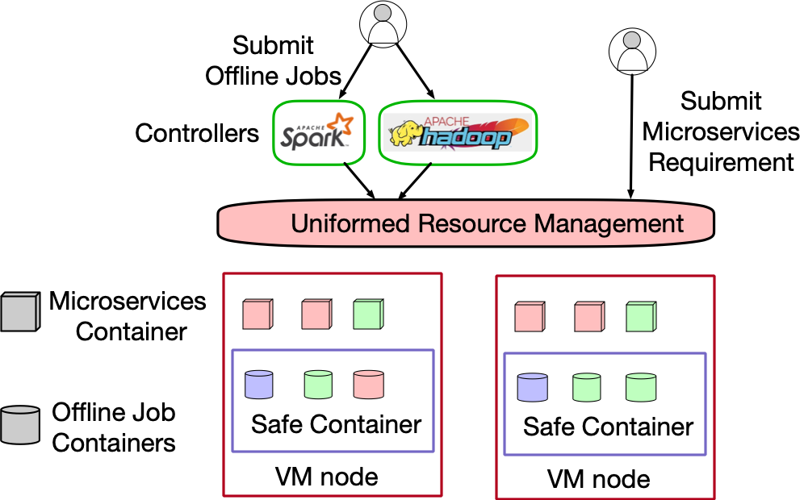

# Overview of Microservices Traces

The released traces contain the detailed runtime metrics of nearly twenty thousand microservices. They are collected from Alibaba production clusters of over ten thousand [bare-metal nodes](https://dl.acm.org/doi/10.1145/3373376.3378507) during twelve hours in 2021.

We conduct a characterization analysis on the trace in a paper, [Characterizing Microservice Dependency and Performance: Alibaba Trace Analysis](http://cloud.siat.ac.cn/pdca/socc2021-AlibabaTraceAnalysis.pdf), published in SoCC’21. And we would encourage anybody who uses this trace to cite our paper.

```BibTeX
@inproceedings{luo2021characterizing,
  title={Characterizing Microservice Dependency and Performance: Alibaba Trace Analysis},
  author={Luo, Shutian and Xu, Huanle and Lu, Chengzhi and Ye, Kejiang and Xu, Guoyao and Zhang, Liping and Ding, Yu and He, Jian and Xu, Chengzhong},
  booktitle={Proceedings of the ACM Symposium on Cloud Computing},
  pages={412--426},
  year={2021}
}
```

# Cluster Architecture

The production cluster contains a large number of bare-metal (BM) nodes and is running in the Alibaba cloud. Users could submit their offline jobs through different controls, which will require resources from uniformed resource management (URM), or send microservices (MS) requirements to URM directly. To improve resource efficiency, URM will place containers of offline jobs and MS on the same BM node. More specifically, containers of offline jobs are scheduled into secure containers, which could be regarded as lightweight virtual machine. This can enhance isolation and mitigate interference from offline jobs to provide performance guarantees for MS containers.



# MS architecture in Alibaba

As shown in this figure, users usually send a web request to the entering MS first, e.g., MS A, which will trigger a series of calls between related microservices. We define the set of these calls as a call graph. As such, a call graph contains multiple calls between different pairs of microservices. Here, a pair of microservices contain one upstream microservice (UM) and one downstream microservice (DM).


Microservices can be categorized into two types, stateless services (e.g., a circle in the above Figure) and stateful services (e.g., a rectangle or hexagon). Stateless services are isolated from state data while stateful services need to store data in some locations, such as Database (DB) and Memcached (MC). There exist three types of communication paradigms between a pair of microservices, i.e., inter-process communication, remote invocation, and indirect communication.

# Introduction of Trace Data

The traces include four parts of data as follows:

node: BM Node runtime information. It records CPU and memory utilization of 1300+ BM nodes in a production cluster.

MS_Resource_Table: MS runtime information. It records CPU and memory utilization of 90000+ containers for 1300+ MSs in the same production cluster.

MS_Metrics_Table: Microservice call rate (MCR) and response time (RT) information. It records MCR and RT of the calls via different communication paradigms among 1300+ MSs with 90000+ containers in the same production cluster.

MS_CallGraph_Table: MS Call Graphs information. Due to the large-scale data size, we sample the call graph based on the rate of 0.5%. It contains about more than twenty million call graphs among 20000+ MSs with in more than ten clusters.

Users could run the following command to fetch data.

> bash fetchData.sh

It includes node/Node.tar.gz, MSCallGraph/MSCallGraph_*.tar.gz, MSResource/MSResource_*.tar.gz, MSRTQps/MSRTQps_*.tar.gz.

Size of each directory:

- 1.1Gi node
- 25Gi MSCallGraph
- 16Gi MSResource
- 19Gi MSRTQps

Usage
In each directory (node,MSCallGraph,MSResource,MSRTQps), please execute:

> for file in `ls *.tar.gz`; do tar -xzf $file; done

node:

| columns            |                          Example Entry                          |
| ------------------ | :--------------------------------------------------------------: |
| timestamp          |                               1000                               |
| nodeid             | ff1fb31957db767c5be4de2855488f128532efc2df0a673c6fa3e7718d10f355 |
| cpu_utilization    |                        0.7236219289416774                        |
| memory_utilization |                        0.738378997619996                        |

- timestamp: Timestamp of recorded metrics. Range from 0 to 43200000 for twelve hours (12 * 60 * 60 * 1000). The recording interval is the 30s (30 * 1000).
- nodeid: The specific id of BM node. It could be joined with nodeid in MS_Resource_Table.
- cpu_utilization: CPU utilization of BM node.
- memory_utilization: Memory utilization of BM node.

MS_Metrics_Table:

| columns            |                          Example Entry                          |
| ------------------ | :--------------------------------------------------------------: |
| timestamp          |                                0                                |
| msname             | 99f2e7b501f50db9b4089242a5d3e1aba334c32e0c718b8d79281529a9489b15 |
| msinstanceid       | 4d1cf65970444ef3ba9870468d7ecf9c17a93782134464767fbdc4aeb6f162eb |
| nodeid             | ecd8a876344d673d8e934f566aae38aec05e572d43ab8d58624bd59e3ec43928 |
| cpu_utilization    |                        0.1299166666654249                        |
| memory_utilization |                        0.6126489639282227                        |

- timestamp: Mentioned in NodeTable. The recording interval is the 60s (60 * 1000).
- msname: The name of MS, to be joined with MSName in MS_MCR_RT_Table, and DM and UM in MS_CallGraph_Table. MSName only contains stateless services, as stateful services run in other dedicated clusters.
- msinstanceid:  The specific container id of MS. An MS may have more than one container.
- nodeid: The specific BM node in which MSInstanceID runs.
- cpu_utilization: CPU utilization of MSInstanceID.
- memory_utilization: Memory utilization of MSInstanceID.

MS_MCR_RT_Table:

| columns      |                          Example Entry                          |
| ------------ | :--------------------------------------------------------------: |
| timestamp    |                             6600000                             |
| msname       | 1e5dd1f5843e50b9282fb99c58d8fe9c6e3d712d9e601a7a5264ca4ff7d96773 |
| msinstanceid | 0c14b76dd7faa42a7e8f5fa5c59ad20e23ff8ce2981c1ff86544e76e72f1cca2 |
| metrics      |                          consumerRPC_RT                          |
| value        |                         9.14142215173143                         |

- timestamp: Mentioned in MS_Metrics_Table.
- msname: Mentioned in MS_Metrics_Table.
- msinstanceid: Mentioned in MS_Metrics_Table.
- metrics: Calls Rate with different communication paradigms and corresponding RT. The value of metrics for an MS is an aggregation of all its DMs and UMs. To distinguish whether an MS is DM or UM, the Metrics are recorded with a prefix before communication paradigms. For example, RPC is named consumerRPC and providerRPC, meaning an MS as the consumer calling its DM and as the provider being called by its UM respectively. Correspondingly, MQ could be classified into two groups from an MS's point of view, namely, providerMQ, and consumerMQ. For the former, MQ is a provider that sends messages to the third party whereas, the latter is a consumer that fetches messages from the third party. As MSs in this table are all stateless services, they are only UMs to read or write stateful services.
  In summary, these metrics include consumerRPC_MCR, providerRPC_MCR, HTTP_MCR, providerMQ_MCR, consumerMQ_MCR, consumerRPC_RT, providerRPC_RT, HTTP_RT, providerMQ_RT, and consumerMQ_RT.
- value: The value of Metrics. For example,  the value of metric providerRPC_MCR and providerRPC_RT characterize the number of calls per second and the average of response time respectively. Here, the response time is measured by millisecond (ms).

MS_CallGraph_Table:

| columns   |                          Example Entry                          |
| --------- | :--------------------------------------------------------------: |
| timestamp |                             16397576                             |
| traceid   |                    015101cd15919399974329000e                    |
| rpcid     |                            0.1.1.2.50                            |
| um        | 35114acfb54c54fb9618f23cd28bbc57c765f597df140977d7030dcc52775ed4 |
| rpctype   |                               rpc                               |
| interface | af42b5e3e0eb334d38619733586d78d1414f6549f24d31b39a5294454638bc59 |
| dm        | b65fdc9bfef6b4974c3e90e1ec7b92d30e639789da5a78c1d4685857e19c75a0 |
| rt        |                                13                                |

- timestamp: Mentioned in MS_CallGraph_Table.
- traceid: Each call graph has a unique traceID.
- rpcid: Each call is identified by a unique rpcID, which contains the ID information of a pair of UM and DM. For example, rpcID 0.1.1 and 0.1.2 denote two calls that two different DMs are called by the same UM, which is the DM in the call with rpcID 0.1. Note that, the call via remote invocation is recorded twice with the same rpcID in the UM and DM independently.
- um: The name of UM.
- rpctype: The communication paradigms. We record rpc_type as "DB" and "MC" for the calls via inter-process communication if DM is DB and MC respectively.
- interface: The interface of DM is called by UM. The calls via remote invocation or HTTP have the interface.
- DM: The name of DM.
- rt: Response time of the call. It is measured by millisecond (ms). If rt is less than 1 ms, e.g. rt of read/write MC, the value will be recorded as 0. For call via RPC, the value of RT could be a positive integer and negative integer, which are recorded in UM and DM respectively, and represents UM RT (from UM sending a request to receiving a reply) and the opposite of DM RT (from DM receiving the request to sending the reply) respectively. The RT of a call via MQ is the interval from DM fetching the message to finishing it. For call via HTTP, the UM and DM RT is also recorded as positive integer and negative integer respectively.

# Discussion

- How to identify a specific service in the traces?

In practice, microservice architecture adopts proxy modules like Nginx to forward users' requests to an entering MS. The entering MS, e.g., interface of entering MS A in Fig.2, containing multiple interfaces, and each interface provides a specific service. As such, each interface of MS called by proxy MS could be labelled as an online service.  As revealed in the paper, we classify the call graphs of each online service into different classes when analyzing the dynamics of microservices. It is worth noting that, some call graphs could even contain two proxy modules, and the name of the second proxy MS are usually recorded as '(?)' or ''.

- Missing items in traces.

In these traces, it happens that some metrics in MS_CallGraph_Table are lost. For example, the name of some MS is recorded as NAN, '(?)' or '' in the traces. As the call via RPC will be recorded twice in MS_CallGraph_Table, some metrics related to rpcID could be found from another record even if one is missing.
