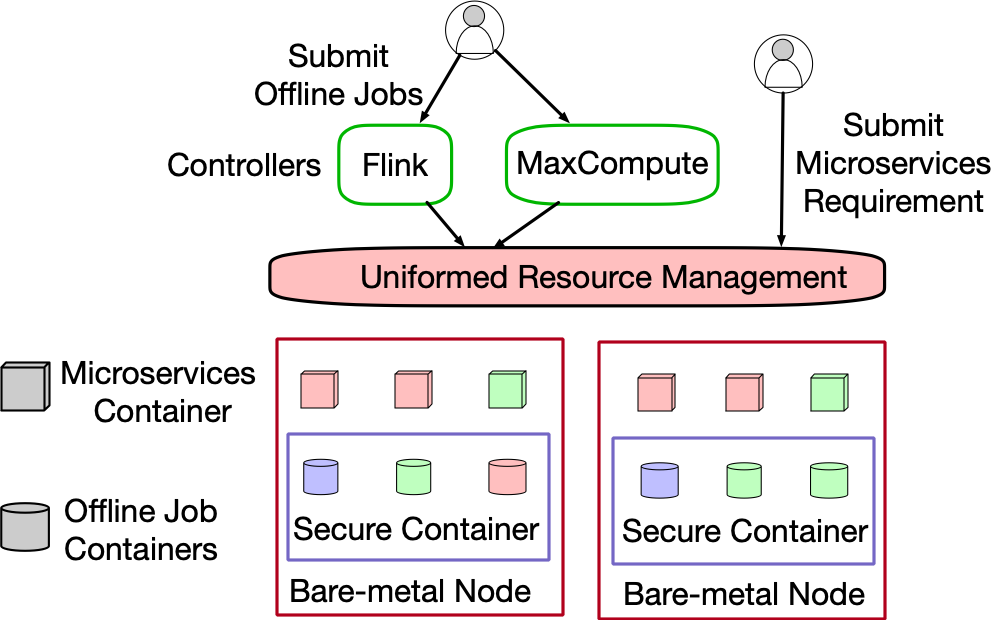
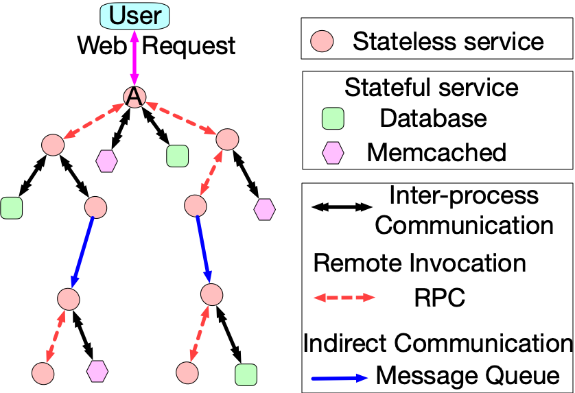

# Overview of Microservices Traces

The released traces contain the detailed runtime metrics of nearly twenty thousand microservices. They are collected from Alibaba production clusters of over ten thousand [bare-metal nodes](https://dl.acm.org/doi/10.1145/3373376.3378507) during 13 days in 2022. In comparison to the previous trace version (v2021), this updated trace offers an extended duration (13 days) and includes additional information, such as the service ID within the call graph.

```BibTeX
@inproceedings{luo2022Prediction,
  title={The Power of Prediction: Microservice Auto Scaling via Workload Learning},
  author={Luo, Shutian and Xu, Huanle and Ye, Kejiang and Xu, Guoyao and Zhang, Liping and Yang, Guodong and Xu, Chengzhong},
  booktitle={Proceedings of the ACM Symposium on Cloud Computing},
  year={2022}
}
```

# Cluster Architecture

The production cluster contains a large number of bare-metal (BM) nodes and is running in the Alibaba cloud. Users could submit their offline jobs through different controls, which will require resources from uniformed resource management (URM), or send microservices (MS) requirements to URM directly. To improve resource efficiency, URM will place containers of offline jobs and MS on the same BM node. More specifically, containers of offline jobs are scheduled into secure containers, which could be regarded as lightweight virtual machine. This can enhance isolation and mitigate interference from offline jobs to provide performance guarantees for MS containers.



# MS architecture in Alibaba

As shown in this figure, users usually send a web request to the entering MS first, e.g., MS A, which will trigger a series of calls between related microservices. We define the set of these calls as a call graph. As such, a call graph contains multiple calls between different pairs of microservices. Here, a pair of microservices contain one upstream microservice (UM) and one downstream microservice (DM).



Microservices can be categorized into two types, stateless services (e.g., a circle in the above Figure) and stateful services (e.g., a rectangle or hexagon). Stateless services are isolated from state data while stateful services need to store data in some locations, such as Database (DB) and Memcached (MC). There exist three types of communication paradigms between a pair of microservices, i.e., inter-process communication, remote invocation, and indirect communication.

# Overview of Trace Data

The traces include four parts of data as follows:

Node: BM Node runtime information. It records CPU and memory utilization of 40000+ BM nodes in a production cluster.

MSResource: MS runtime information. It records CPU and memory utilization of 470000+ containers for 28000+ MSs in the same production cluster.

MSRTMCR: Microservice call rate (MCR) and response time (RT) information. It records MCR and RT of the calls via different communication paradigms among 28000+ MSs with 470000+ containers in the same production cluster.

MSCallGraph: MS Call Graphs information. It contains about more than twenty million call graphs among 17000+ MSs with in more than ten clusters.

Note: The value of resource utilization and the MCR has been **normalized** by Max-min method.

# Trace Data Download

User can use the following script to download the trace with different intervals.

> bash fetchData.sh start_date=0d0 end_date=1d1

Where the `start_date` and `end_date` follow the following format: `${day}d${hour}`, and they are `[start_date, end_date)`. The day and hour are all started by 0, data will be saved in `data/MSCallGraph`, `data/MSResource`, `data/Node` and `data/MSRTMCR` respectively.

Size of each directory (compressed) for an hour:

- ~10Mi Node
- ~4Gi MSCallGraph
- ~700Mi MSResource
- ~3Gi MSRTMCR

The size of all files for 13 days is about 2T.

Usage
In each directory (Node,MSCallGraph,MSResource,MSRTMCR), please execute:

> for file in `ls *.tar.gz`; do tar -xzf $file; done

# Introduction of Trace Data

Node:

| columns            |   Example Entry   |
| ------------------ | :---------------: |
| timestamp          |       60000       |
| nodeid             |    NODE_10632    |
| cpu_utilization    | 0.266488095525847 |
| memory_utilization | 0.159064258887333 |

- timestamp: Timestamp of recorded metrics. The recording interval is the 60s (60 * 1000).
- nodeid: The specific id of BM node. It could be joined with nodeid in MS_Resource_Table.
- cpu_utilization: **Normalized** CPU utilization of BM node.
- memory_utilization: **Normalized** memory utilization of BM node.

MSResource:

| columns            |    Example Entry    |
| ------------------ | :-----------------: |
| timestamp          |       180000       |
| msname             |      MS_21881      |
| msinstanceid       |   MS_21881_POD_0   |
| nodeid             |     NODE_11517     |
| cpu_utilization    | 0.21995999999530616 |
| memory_utilization |  0.833001454671224  |

- timestamp: Mentioned in Node. The recording interval is the 60s (60 * 1000).
- msname: The name of MS, to be joined with MSName in MS_MCR_RT_Table, and DM and UM in MS_CallGraph_Table. MSName only contains stateless services, as stateful services run in other dedicated clusters.
- msinstanceid:  The specific container id of MS. An MS may have more than one container.
- nodeid: The specific BM node in which MSInstanceID runs.
- cpu_utilization: **Normalized** CPU utilization of MSInstanceID.
- memory_utilization: **Normalized** memory utilization of MSInstanceID.

MSRTMCR:

| columns         |     Example Entry     |
| --------------- | :--------------------: |
| timestamp       |         60000         |
| msname          |        MS_73317        |
| msinstanceid    |   MS_73317_POD_1797   |
| nodeid          |       NODE_3619       |
| providerrpc_rt  |   10.119451170298627   |
| providerrpc_mcr | 1.216773932801612e-05 |
| consumerrpc_rt  |   9.996974281391829   |
| consumerrpc_mcr | 7.169679436055699e-12 |
| writemc_rt      |          0.0          |
| writemc_mcr     |          0.0          |
| readmc_rt       |        0.40625        |
| readmc_mcr      | 3.142596113773332e-07 |
| writedb_rt      |          0.0          |
| writedb_mcr     |          0.0          |
| readdb_rt       |   0.9693548387096775   |
| readdb_mcr      | 6.088779970435831e-06 |
| consumermq_rt   |          0.0          |
| consumermq_mcr  |          0.0          |
| providermq_rt   |    24.4218009478673    |
| providermq_mcr  | 2.0721493125192907e-06 |
| http_mcr        |          0.0          |
| http_rt         |          0.0          |

- timestamp: Mentioned in Node. The recording interval is the 60s (60 * 1000).
- msname: Mentioned in MSResource.
- msinstanceid: Mentioned in MSResource.
- nodeid: Mentioned in Node.
- Other columns: The value of corresponding RT and calls rate with different communication paradigms. For example, the value of metric providerRPC_MCR and providerRPC_RT characterize the number of calls per second and the average of response time respectively. Here, the response time is measured by millisecond (ms) and the MCR is **normalized** through max-min in range from 0 to 1. The value of metrics for an MS is an aggregation of all its DMs and UMs. To distinguish whether an MS is DM or UM, the Metrics are recorded with a prefix before communication paradigms. For example, RPC is named consumerRPC and providerRPC, meaning an MS as the consumer calling its DM and as the provider being called by its UM respectively. Correspondingly, MQ could be classified into two groups from an MS's point of view, namely, providerMQ, and consumerMQ. For the former, MQ is a provider that sends messages to the third party whereas, the latter is a consumer that fetches messages from the third party. As MSs in this table are all stateless services, they are only UMs to read or write stateful services.
  In summary, these metrics include consumerRPC_MCR, providerRPC_MCR, HTTP_MCR, providerMQ_MCR, consumerMQ_MCR, consumerRPC_RT, providerRPC_RT, HTTP_RT, providerMQ_RT, and consumerMQ_RT.

MSCallGraph:

| columns      |  Example Entry  |
| ------------ | :--------------: |
| timestamp    |      115352      |
| traceid      |  T_11560863075  |
| service      |   S_153587416   |
| rpc_id       |       0.1       |
| um           |     MS_58845     |
| uminstanceid |  MS_58845_POD_0  |
| rpctype      |       rpc       |
| interface    |    xOuy6-80Vt    |
| dm           |     MS_71712     |
| dminstanceid | MS_71712_POD_244 |
| rt           |       2.0       |

- timestamp: Mentioned in Node.
- traceid: Each call graph has a unique traceID.
- service: Online service id. A specific online service provides a function for users. For example, the online shopping application can provide multiple online services, including ordering, goods searching, delivering and so on.
- rpcid: Each call is identified by a unique rpcID, which contains the ID information of a pair of UM and DM. For example, rpcID 0.1.1 and 0.1.2 denote two calls that two different DMs are called by the same UM, which is the DM in the call with rpcID 0.1. Note that, the call via remote invocation is recorded twice with the same rpcID in the UM and DM independently.
- um: The name of UM.
- uminstanceid: The specific container id of um MS. An MS may have more than one container.
- rpctype: The communication paradigms. We record rpc_type as "DB" and "MC" for the calls via inter-process communication if DM is DB and MC respectively.
- interface: The interface of DM is called by UM. The calls via remote invocation or HTTP have the interface.
- dm: The name of DM.
- dminstanceid: The specific container id of dm MS. An MS may have more than one container.