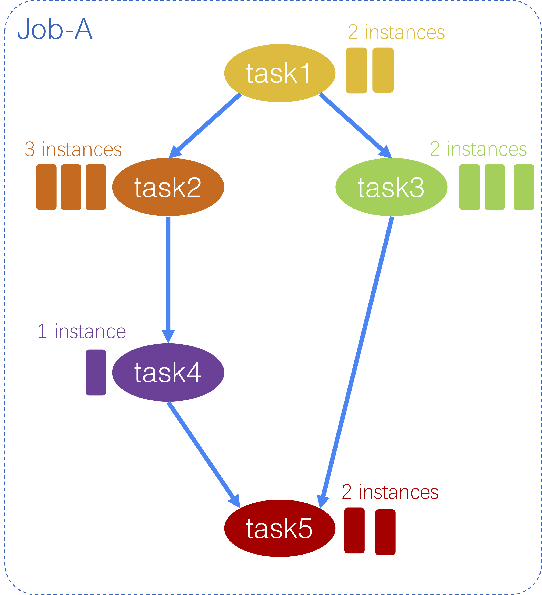

# 1 Introduction

As part of the Alibaba Open Cluster Trace Program, a new version of cluster trace, `cluster-trace-v2018`, is released this year. The trace is sampled from one of our production clusters. Similar to the trace from 2017, there are both online services (aka long running applications, LRA) and batch workloads colocated in every machine in the cluster. Over the past year, the scale of colocation of online services and batch workloads have greatly increased resulting in the improvement of our overall resource utilization.

The colocated workloads are managed by the coordination of two schedulers, Sigma for online services and Fuxi for batch workloads. The figure below depicts the architecture of Sigma and Fuxi coloation.


# 2 Data Files for The Trace

## 2.1 About

Cluster-trace-v2018 includes about 4000 machines in a perids of 8 days and is consisted of 6 tables (each is a file). Here is a brief introduction of the tables and the detail of each table is provided in section *2.2 Schema*.

* machine_meta.csv：the meta info and event infor of machines.
* machine_usage.csv: the resource usage of each machine.
* container_meta.csv：the meta info and event infor of containers.
* container_usage.csv：the resource usage of each container.
* batch_instance.csv：inforamtion about instances in the batch workloads.
* batch_task.csv：inforamtion about instances in the batch workloads. Note that the DAG information of each job's tasks is described in the task_name field.

### Downloading the data

The dowload link will be available after a very short survey ([survey link](http://alibabadeveloper.mikecrm.com/BdJtacN)). We kindly ask you to do this so that we could inform you about big annoucement later on, and we will keep the information in the form confidential.

You can verify your download as follows.

Checksum:

(separate files)
```
$sha256sum *
e73e5a9326669aa079ba20048ddd759383cabe1fe3e58620aa75bd034e2450c6  batch_instance.tar.gz
7c4b32361bd1ec2083647a8f52a6854a03bc125ca5c202652316c499fbf978c6  batch_task.tar.gz
febd75e693d1f208a8941395e7faa7e466e50d21c256eff12a815b7e2fa2053f  container_meta.tar.gz
b4bd3b1b82f5407c1b0dd47fe736ff5152c4b016a9c30cb26f988e2d1c5e5031  container_usage.tar.gz
b5b1b786b22cd413a3674b8f2ebfb2f02fac991c95df537f363ef2797c8f6d55  machine_meta.tar.gz
3e6ee87fd204bb85b9e234c5c75a5096580fdabc8f085b224033080090753a7a  machine_usage.tar.gz
```

(single file)
```
$sha256sum alibaba_clusterdata_v2018.tar.gz
ccb3dc93786507dd42eed29ef62c82220d07f877f269e5fad39f31bf75134ed1  alibaba_clusterdata_v2018.tar.gz
```

Size of files (note you need either 6 separate files or single `alibaba_clusterdata_v2018.tar.gz` file):
```
$ls -sh1
total 98G
 49G alibaba_clusterdata_v2018.tar.gz
 20G batch_instance.tar.gz
125M batch_task.tar.gz
2.4M container_meta.tar.gz
 28G container_usage.tar.gz
 92K machine_meta.tar.gz
1.7G machine_usage.tar.gz
```

## 2.2 Schema

For the sake of clearity, all scheme description is moved to [schema](./schema.txt).

**Some explanation of common fields.**

* time_stamp, start_time and end_time: These fields in the tables are all with unit "second" and the number is the difference of between the actual time and the beginning of the period over which the trace is sampled. The beginning of period is 0.
* For confidential reason, we normalize some values such as memory size and disk size and rescale such field between [0, 100]. However, there are some invalid values and they are set to either -1 or 101.

## 2.3 DAG of batch workloads

*In this version of cluster data, we include many types of batch workloads. Most of them are DAGs while some of them are not. For those tasks that are not DAGs, we name them using random characters, such as `task_Nzg3ODAwNDgzMTAwNTc2NTQ2Mw==` or `task_Nzg3ODAwNDgzMTAwODc2NTQ3MQ==`. These tasks can be treated as independent tasks. In the remainder of this section, we explain how to deduce DAG of a job from the task names.*

A complete batch computation job can be described using "job-task-instance" model. We will describe the meaning of each term and how the DAG information is expressed in the trace.

A job is typically consisted of several tasks whose depencies are expressed by DAG (Directed Acyclic Graph). Each task has a number of instances, and only when all the instances of a task are completed can a task be considered as "finished", i.e. if task-2 is depending on task-1, any instance of task-2 cannot be started before all the instances of task-1 are completed. The DAG of tasks in a job can be deduced from the `task_name` field of all tasks of this job, and it is explained with the following example.

The DAG of Job-A is shown in the following figure. Job-A is consisted of 5 tasks with some dependencies. The DAG of the 5 tasks are expressed with their `task_name`. For each task:

* `task1`'s `task_name` is `M1`: means that `task1` is an independent task and can be started without waiting for any other task. Similarly for th rest
* `M2_1`: means that `task2` depends on the finishing of `task1`
* `M3_1`: means that `task3` depends on the finishing of `task1`
* `R4_2`: means that `task4` depends on the finishing of `task2`
* `M5_3_4`: means that `task5` depends on both `task3` and `task4`, that is, `task5` cannot start before all instances of both `task3` and `task4` are completed.

Note that for DAG information, only the numeric figure in the task_name matters, while the first charactor (e.g. `M`, `R` in the example) has nothing to do with dependency.

The number of instances for each task is expressed with another field `instance_num`.



# 3 Known Issues

> Empty for now.

# 4 Frequent Questions

> Empty for now.

If you do not want to do the survey ([survey link](http://alibabadeveloper.mikecrm.com/BdJtacN)), you could have the trace too.

The entire data set is about 48GB in .tar.gz format and 280GB after extraction. Due to [issue #49](https://github.com/alibaba/clusterdata/issues/49), we provide two download links, one for Chinese users and other for oversea users, and you can choose whichever suits you.

## Download

Users can run the following command to fetch 6 files. 
> bash fetchData.sh
  
# 5 Acknowledgement

This version of cluster data would not have been well prepared without help from several interns, Jing Guo, Zihao Chang, Kangjing Wang, and Guoyao Xu, etc. Their efforts in data collection, verification, and document writing are very much appreciated.
