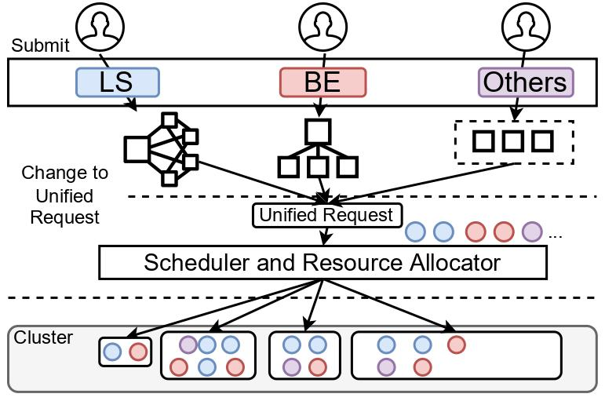

# Overview of Unified Scheduler Traces

The released traces contain the detailed runtime metrics of nearly nine thousand machines and over five hundred thousand pods belonging to over ten thousand applications. They are collected from Alibaba production clusters during a week in 2022. The traces provide some new information about the clusters with the unified scheduler. We characterize the unified scheduling clusters with the trace datasets and design an optimization method to help to improve the resource utilization of the clusters. The paper has been accepted by EuroSys'23. And we would encourage anybody who uses this trace to cite our paper.

```python
@inproceedings{lu2023understanding,
  title={Understanding and Optimizing Workloads for Unified Resource Management in Large Cloud Platforms},
  author={Lu, Chengzhi and Xu, Huanle and Ye, Kejiang and Xu, Guoyao and Zhang, Liping and Yang, Guodong and Xu, Chengzhong},
  booktitle={Proceedings of the Eighteenth European Conference on Computer Systems},
  pages={416--432},
  year={2023}
}
```

# Cluster Architecture

Unified scheduling in Alibaba data centers has fully unified the scheduling of e-commerce, search and promotion, MaxCompute, and Ant businesses. Before an application (such as a MapReduce job or a long-running web service) can run its tasks under unified scheduling, it first follows its application-specific task execution plan, reconstructing a set of task requests according to the Unified Request format, and then submits these requests (with affinity requirements) to the API Server. After receiving the task requests, the unified scheduler selects an appropriate physical host to place each task following its scheduling policy. Specifically, the scheduler first selects the nodes satisfying the affinity as the candidate nodes for the task and then ranks these candidate nodes according to their balance between the resource utilization and the SLO (Service Level Objective) requirement of the task request. Then an agent located on the selected host will start a pod that consists of several containers to run the new scheduled task.



# Tables

We collect the metrics of node-, pod- and container-level from the clusters and use a max-min scaler to normalize the numeric values like *_usage, *_util and *_bytes.

### 1. node running metrics

| Column Name               | Description                                     | Type   | Example Entry                    |
| ------------------------- | ----------------------------------------------- | ------ | -------------------------------- |
| collect_timestamp         | Timestamp, the number of seconds from the start | int    | 46309                            |
| node_name                 | the node name                                   | string | 104a3526662b2768549d116ee5a36b24 |
| node_cpu_usage            | the cpu usage of the node                       | float  | 0.0059184                        |
| node_memory_util          | the memory utilization of the node              | float  | 0.33276688                       |
| node_memory_total_bytes   | the memory capacity of the node                 | float  | 0.35017976                       |
| node_network_bandwidth    | the network bandwidth of the node               | float  | 0.04762132                       |
| node_network_receive_bps  | the total recieve bytes of the node             | float  | 0.0000237                        |
| node_network_transmit_bps | the total transmit bytes of the node per sampl  | float  | 0.00007433                       |
| node_cpu_cores            | the node cpu numbers                            | float  | 0.5                              |
| node_disk_io_usage        | the io utilization of the node                  | float  | 0.0003389                        |

`collect_timestamp`: Some `collect_timestamp` may be negative because the entry is collected before the start of the trace.

### 2. pod meta info

| Column Name      | Description                                                  | Type   | Example Entry                    |
| ---------------- | ------------------------------------------------------------ | ------ | -------------------------------- |
| create_timestamp | Pod creation timestamp, the number of seconds from the start | int    | 2202266                          |
| pod              | the pod name                                                 | string | 65c3924ccc3145e4a348f3328d40c606 |
| cpu              | CPU request number                                           | float  | 0.0390625                        |
| memory           | memory request bytes                                         | float  | 0.01589419                       |
| disk             | disk request number                                          | float  | 0.0                              |
| cpu_limit        | CPU limit number                                             | float  | 0.046875                         |
| memory_limit     | Memory limit bytes                                           | float  | 0.01589419                       |
| disk_limit       | disk limit number                                            | float  | 0.0                              |
| qos              | QoS of the pod                                               | string | "BE"                             |

`create_timestamp`: Some `create_timestamp` may be negative because the pod is created before the start of the trace.

`qos`: Some `qos` is empty because the pod has no SLO requirement.

### 3. pod running metrics

| Column Name                         | Description                                     | Type   | Example Entry                                         |
| ----------------------------------- | ----------------------------------------------- | ------ | ----------------------------------------------------- |
| collect_timestamp                   | Timestamp, the number of seconds from the start | float  | -3390                                                 |
| node_name                           | the node name                                   | string | be8cf1b4733b1292cb6af34d24f5f723                      |
| pod                                 | the pod name                                    | string | bbe70f56eb2e6b7f3833531e6b837602                      |
| app_group                           | the application name that the pod belongs to    | string | 329437a0e697b328a4ea5b8a98d54e2c                      |
| pod_cpu_limit_usage                 | the cpu limit usage of the pod                  | float  | 0.00055937                                            |
| pod_cpu_request_util                | the cpu request utilization of the pod          | float  | 0.05074873                                            |
| pod_memory_util                     | the memory utilization of pod                   | float  | 0.50453097                                            |
| pod_memory_usage_bytes              | the memory usage bytes of the pod               | float  | 0.00940145                                            |
| pod_disk_read_bps_total             | the pod disk read BPS                           | float  | 0.0                                                   |
| pod_disk_write_bps_total            | the pod disk write BPS                          | float  | 0.04751506                                            |
| pod_disk_read_iops_total            | the pod disk read IOPS                          | float  | 0.0                                                   |
| pod_disk_write_iops_total           | the pod disk write IOPS                         | float  | 0.27036923                                            |
| pod_network_transmit_bytes_ps_total | the pod network transimission BPS               | float  | 0.05314832                                            |
| pod_network_receive_bytes_ps_total  | the pod network recieve BPS                     | float  | -1.0                                                  |
| cpu_psi                             | CPU PSI                                         | string | 0.0;0.01;0.05;3113525409.0                            |
| mem_psi                             | Memory PSI                                      | string | 0.0;0.0;0.0;0.0;0.0;0.0;56.0;57.0                     |
| disk_psi                            | Disk PSI                                        | string | 0.0;0.0;0.0;0.0; 0.0;0.0;531401.0;536175.0 |
| web_qps                             | the web query per second of the pod             | float  | 0.0                                                   |
| qps                                 | the total query per second of the pod          | float  | 0.0                                         |
| rt                                  | the main response time of the pod              | float  | 0.0                                         |

[`psi`](https://docs.kernel.org/accounting/psi.html) (Pressure Stall Information) identifies and quantifies the disruptions caused by such resource crunches and the time impact it has on complex workloads or even entire systems.

`cpu_psi`: seperated by `;`, each item represents `cpu_avg10 `, `cpu_avg60 `, `cpu_avg300 `,`cpu_psi_total` respectively.

`mem_psi`: seperated by `;`, each item represents `mem_avg10_full `, `mem_avg10_some`, `mem_avg60_full`, `mem_avg60_some`, `mem_avg300_full `, `mem_avg300_some`, `mem_total_full`, `mem_total_some` respectively.

`disk_psi`: seperated by comma, each item represents `disk_avg10_full`, `disk_avg10_some`, `disk_avg60_full`, `disk_avg60_some`, `disk_avg300_full`, `disk_avg300_some`, `disk_total_full`, `disk_total_some` respectively.

`web_qps` and `qps`:  We separate the qps of a pod to web qps and total qps. Web QPS can be seen as the number of requests that may be generated by the user and will invoke all the services in the applications (like [microservices](https://github.com/alibaba/clusterdata/tree/master/cluster-trace-microservices-v2022)). Total QPS is the total number of requests that come from all other pods in the cluster.

Some metrics may be -1 in the trace data, which represents the metric is not available at that time.

# Fetch DataSet

User can use the following script to download the trace.

``bash fetch.sh``

The node and pod running metrics are divided into multiple compressed packages, each containing one hour of running metrics. Size of each directory (compressed) for an hour:

* ~140Mi Node
* ~1.5Gi Pod
