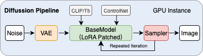

# GenAI Serving Top-Down Dataset 2026 (GenTD26)

## Dataset Overview

The ``GenTD26`` dataset provides a comprehensive **top-down view** of a large-scale generative AI serving system, capturing performance data across three architectural layers: **application layer** (user requests and end-to-end latency), **middleware layer** (gateway queues, schedulers, and pipeline management), and **infrastructure layer** (container resources, GPU utilization, and memory usage). 

To protect privacy, the original data has been anonymized through techniques such as timestamp shifting, metric scaling, and identifier hashing, while carefully preserving distribution characteristics and correlations essential for research.

This dataset is comprehensive and captures the complexity of production serverless inference systems, with many insights we haven't fully explored yet. We hope it can support further research in the community. We encourage you to discover findings from this dataset that support your research, and welcome discussions with us through issues or email.

### Stable Diffusion Serving Pipeline
The Stable Diffusion image generation pipeline follows a multi-stage iterative process: it starts with random **Noise** in latent space, which is then encoded by the **VAE** encoder. The core generation loop iteratively processes this latent representation through a combination of **Base Model** weights, **UNet** architecture, **ControlNet** guidance, and **LoRA** adapters—this denoising step is repeated multiple times with a **Sampler** (e.g., DDPM, DDIM, Euler) controlling the denoising schedule. After the iterative refinement completes, the final latent representation is decoded by the VAE decoder to produce the output **Image** in pixel space. This architecture enables flexible customization through modular components while maintaining efficient inference performance.





In production environments, user requests may contain one base model with multiple LoRAs. Typically, the parameters of multiple LoRAs are merged together into the base model.


## Dataset Structure

cluster-trace-v2026-GenAI

├── qps.csv # System QPS sampling data from gateway\
├── queue_size_raw_anon.csv # Queue size monitoring data from gateway\
├── queue_rt_raw_anon.csv # Queue response time monitoring data from gateway\
├── pipeline_update_latency_anon.csv # Pipeline update latency, including base model, LoRA, and ControlNet\
├── base_model_update_latency_anon.csv # Base model loading latency\
├── lora_update_latency_anon.csv # LoRA adapter loading latency\
├── controlnet_latency_data_anon.csv # ControlNet loading latency\
├── pod_memory_util_anon.csv # Container memory utilization\
├── pod_gpu_duty_cycle_anon.csv # GPU utilization of each kubernetes pod\
├── pod_gpu_memory_used_bytes_anon.csv # GPU memory usage of each kubernetes pod\
├── model_predict_data_anon.csv # Pure inference latency\
├── pipeline_inference_data_anon.csv # End-to-end inference response time\
└── **lora_request_trace.csv** # Application-level performance data from user side


## Data Relationship Description

All data files can be correlated through the `container_ip` field, which is an MD5 hash of the container IP address. This ensures that the same original IP maps to the same hash value. Service performance metrics (e.g., model loading latency) can be correlated with system performance metrics (e.g., GPU utilization) through this field.

## Detailed File Descriptions

### 1. System Query Per Second (QPS)

- **File**: `qps.csv`
- **Description**: Anonymized sampling data of system request volume, including generative requests and API requests
- **Data Sources**:
  - `glaucus.log.scene.qps` (generative scenarios, reported by container)
  - `relationrecommend.log.inference.api.qps` (API layer requests)

| Field Name | Type | Description |
|------------|------|-------------|
| `timestamp_anon` | float | Anonymized timestamp, unit: seconds |
| `value` | float | Anonymized QPS value, preserves trend proportions |
| `container_ip` | string | MD5 hash of container IP, empty values as `None` |
| `request_type` | string | Request type: `Generative Requests` / `API Requests` |

**Note**: This data is at raw sampling granularity (single container, single timestamp). When plotting, sum QPS across all containers in the same time window - aggregated values will be significantly larger than individual points.

### 2. Queue Monitoring Data

#### 2.1 Queue Size
- **File**: `queue_size_raw_anon.csv`
- **Description**: Monitoring of request queue backlog size

#### 2.2 Queue Response Time
- **File**: `queue_rt_raw_anon.csv`
- **Description**: Monitoring of request queuing time

**Field Description** (same structure for both files):

| Field Name | Type | Description |
|------------|------|-------------|
| `timestamp_anon` | float | Anonymized timestamp |
| `value` | float | Metric value: queue size (number of tasks) or queuing time (milliseconds) |
| `container_ip` | string | MD5 hash of container IP |

### 3. Model Component Loading Latency

#### 3.1 Pipeline Update Latency
- **File**: `pipeline_update_latency_anon.csv`
- **Description**: Complete inference pipeline (Basemodel-LoRA-Controlnet) loading/switching latency

#### 3.2 Base Model Loading Latency
- **File**: `base_model_update_latency_anon.csv`
- **Description**: Base model loading latency, typically occurs before pipeline loading, main component of cold start

#### 3.3 LoRA Adapter Loading Latency
- **File**: `lora_update_latency_anon.csv`
- **Description**: Time taken to load LoRA weights from storage to GPU memory

#### 3.4 ControlNet Loading Latency
- **File**: `controlnet_latency_data_anon.csv`
- **Description**: Time taken to load ControlNet weights

**Common Field Description** (applicable to 3.1-3.4):

| Field Name | Type | Description |
|------------|------|-------------|
| `timestamp_anon` | float | Anonymized timestamp |
| `value` | float | Loading latency (milliseconds) |
| `container_ip` | string | MD5 hash of container IP, `"NULL"` indicates original empty value |

### 4. Resource Utilization Monitoring

#### 4.1 Container Memory Utilization
- **File**: `pod_memory_util_anon.csv`
- **Description**: Container-level memory usage monitoring

| Field Name | Type | Description |
|------------|------|-------------|
| `timestamp_anon` | float | Anonymized timestamp |
| `value` | float | Memory utilization (percentage) |
| `container_ip` | string | MD5 hash of container IP |

#### 4.2 GPU Utilization
- **File**: `pod_gpu_duty_cycle_anon.csv`
- **Description**: Container-level GPU utilization monitoring

| Field Name | Type | Description |
|------------|------|-------------|
| `timestamp_anon` | float | Anonymized timestamp |
| `value` | float | GPU utilization (percentage) |
| `container_ip` | string | MD5 hash of container IP |

#### 4.3 GPU Memory Usage
- **File**: `pod_gpu_memory_used_bytes_anon.csv`
- **Description**: GPU memory usage monitoring

| Field Name | Type | Description |
|------------|------|-------------|
| `timestamp_anon` | float | Anonymized timestamp |
| `value` | int | GPU memory usage (bytes) |
| `container_ip` | string | MD5 hash of container IP |

### 5. Inference Performance Data

#### 5.1 Pure Inference Latency
- **File**: `model_predict_data_anon.csv`
- **Description**: Pure model inference time, excluding loading time

| Field Name | Type | Description |
|------------|------|-------------|
| `timestamp_anon` | float | Anonymized timestamp |
| `value` | float | Inference latency (milliseconds) |
| `container_ip` | string | MD5 hash of container IP |

#### 5.2 End-to-End Inference Response Time
- **File**: `pipeline_inference_data_anon.csv`
- **Description**: Complete inference pipeline response time, including model loading and inference

| Field Name | Type | Description |
|------------|------|-------------|
| `timestamp_anon` | float | Anonymized timestamp |
| `value` | float | End-to-end latency (milliseconds) |
| `container_ip` | string | MD5 hash of container IP |

### 6. Request-Level Performance Data
- **File**: `lora_request_trace.csv`
- **Description**: Detailed inference request performance characteristics including execution time, prompt complexity, etc.

| Field Name | Type | Description | Example |
|------------|------|-------------|---------|
| `predict_type` | string | MD5 hash identifier of request type | `e867a9754d73155e90d62f88dbedfc62` |
| `exec_time_seconds` | float | Inference execution time (seconds) | `22.0` |
| `style_type` | string | MD5 hash identifier of style type, can be empty | `88585aaa7d5402c0928a0c8639c83bab` |
| `prompt_length` | float | Positive prompt length (character count) | `54.0` |
| `negative_prompt_length` | float | Negative prompt length (character count), can be empty | `26.0` |
| `num_images_per_prompt` | float | Number of images generated per prompt | `1.0` |
| `num_inference_steps` | float | Number of inference steps | `30.0` |
| `checkpoint_model_version_id` | string | MD5 hash identifier of base model version | `0a80ffe64c68aa574e80e6c9b9f5308a` |
| `lora_args` | string | LoRA adapter parameters list (JSON format) | `[{'modelVersionId': '799974951f19a0c730acda2389cc852b', 'scale': 1.0}]` |

## Anonymization Description

All data has undergone strict anonymization processing:

### Identifier Anonymization
- **Method**: MD5 hash algorithm
- **Applied Fields**: Container IP, model version ID, request type, etc.
- **Feature**: Same original value always maps to same hash value, ensuring correlation

## Usage Recommendations

### Data Preprocessing
1. **Timestamp Alignment**: All files use the same anonymization algorithm for `timestamp_anon` field, enabling cross-metric temporal alignment
2. **Null Value Handling**: Recommend unifying `"NULL"` and `None` as missing values
3. **Data Aggregation**: Raw data is fine-grained sampling; recommend aggregating by time windows (e.g., 10 minutes) for analysis

### Analysis Scenarios
1. **Performance Correlation Analysis**: Correlate service performance metrics with system resource metrics through `container_ip`
2. **Time Series Analysis**: Analyze trends and periodic patterns of various metrics over time
3. **Anomaly Detection**: Dataset includes monitoring data from both normal and abnormal periods, suitable for anomaly detection algorithm validation
4. **Resource Optimization**: Optimize container scheduling and resource allocation based on resource utilization data

### Research Applications
- **System Performance Analysis**: Understand performance characteristics and bottlenecks of complex inference systems
- **Scheduling Algorithm Research**: Validate resource scheduling algorithms based on real load data
- **Capacity Planning**: Predict resource requirements based on historical load patterns
- **AIOps Research**: Develop intelligent operations and automated fault detection algorithms

## Data Quality Statement

- **Completeness**: Dataset includes all sampling data from continuous monitoring period
- **Consistency**: All files use the same anonymization algorithms and timestamp processing
- **Correlatability**: Support cross-file data correlation through `container_ip` field
- **Authenticity**: Data originates from real production environment, reflecting actual system behavior

## Papers Using This Dataset
| If you use this dataset, welcome to submit a pull request or email Yanying (yanying1709 at gmail dot com), and we will add your paper to this list.

- [Rock: Serving Multimodal Models in Cloud with Heterogeneous-Aware Resource Orchestration for Thousands of LoRA Adapters](https://doi.org/10.1109/CLUSTER59342.2025.11186463) (CLUSTER '25) 

- [Understanding Diffusion Model Serving in Production: A Top-Down Analysis of Workload, Scheduling, and Resource Efficiency]() (SoCC '25) 

- [FlexPipe: Adapting Dynamic LLM Serving Through Inflight Pipeline Refactoring in Fragmented Serverless Clusters](https://doi.org/10.1145/3767295.3769316) (EuroSys '26)


## Citation


If you use this dataset for analyzing request characteristics of diffusion models, GPU utilization patterns, or queue behavior, please cite our SoCC paper:

```bibtex
@inproceedings{yan2025Understanding,
  title = {Understanding Diffusion Model Serving in Production: A Top-Down Analysis of Workload, Scheduling, and Resource Efficiency},
  author = {Yanying Lin, Shuaipeng Wu, Shutian Luo, Hong Xu, Haiying Shen, Chong Ma, Min Shen, Le Chen, Chengzhong Xu, Lin Qu, Kejiang Ye},
  year = {2025},
  booktitle = {ACM Symposium on Cloud Computing (SoCC '25)},
}
```

If you use this dataset to analyze request distribution pattern changes across different time periods or GPU disaggregation across different servers, please cite our EuroSys paper:

```bibtex
@inproceedings{yan2026FlexPipe,
  title = {FlexPipe: Adapting Dynamic LLM Serving Through Inflight Pipeline Refactoring in Fragmented Serverless Clusters},
  author = {Yanying Lin, Shijie Peng, Chengzhi Lu, Chengzhong Xu, and Kejiang Ye},
  year = {2026},
  booktitle = {European Conference on Computer Systems (EuroSys '26)},
  pages = {1-17},
  doi = {10.1145/3767295.3769316}
}
```

